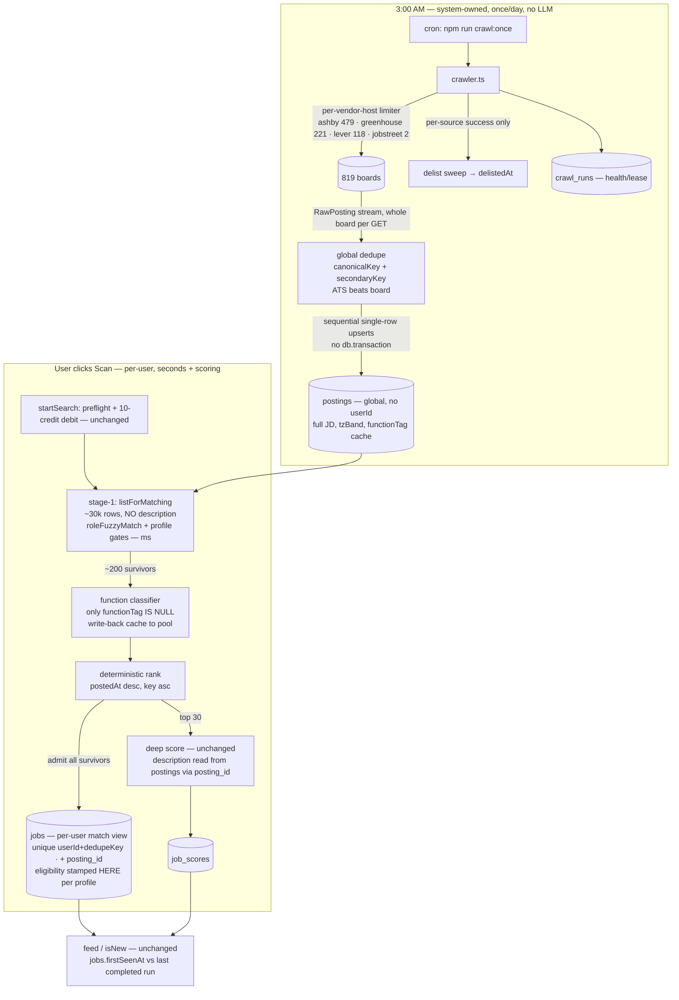

# Global Postings Pool — Architecture Design

Date: 2026-07-17. Status: **design for operator approval — concretizes**
`2026-07-16-remote-startup-niche-source-expansion-design.md` §4.4 and
`2026-07-17-source-engine-ignition.md` Track 3 (both milestone-level, <70% confidence)
into decided architecture. A subsequent `/plan` pass turns §12 into tasks.
Grounding: code read 2026-07-17 (`run.ts`, `schema.ts`, `repos/jobs.ts`, `dedupe.ts`,
`describe.ts`, `jobsFeed.ts`, `db.ts`, `connectors/*`) + this session's measured numbers.

---

## 0. The operator's goal, restated

> "the 800 boards is what we do in the back and we serve users from the 800 boards that
> WE the system has recorded. whenever a user makes a request, it will be from the synced
> board that we have already crawled … a table … that runs at 3am every morning maybe,
> and user will query against the aggregated board … my goal is for all users to query a
> table that we will fetch from these 800 boards every morning so that it saves so much more."

**Restated:** the system — not the user — talks to the 819 enabled boards. A scheduled
crawler (nightly, ~03:00) fetches every board once and writes the result into one shared
`postings` table. A user's scan never touches the network for discovery again: it reads
the already-crawled table. The 800-board network cost is paid **once per day, total**,
instead of **once per scan, per user**.

That is exactly what this design builds. The operator's mental model is right and stays
right for the expensive half of the problem (the crawl). The one refinement it needs:

### 0.1 Why "query the table" is per-user *matching*, not a plain SELECT

Every user has a different résumé. "Their jobs" is not a WHERE clause the pool can
pre-compute — it is their résumé's role targets matched against the pool
(`deriveRoleTargets(resume)` → `roleFuzzyMatch`, `roleMatch.ts:207,239`), then their
profile's gates (relocation / tz-band, `run.ts:551-556`), then a deep LLM score against
their résumé text. Two users querying the identical pool get different, correct results.

So the request path is still per-user — **but it is now cheap**, because everything
per-user happens over *local rows* instead of 819 network fetches:

| | Today (per-user fan-out) | Pooled |
|---|---|---|
| Fetch 819 boards | every scan, every user (~2–5 min network) | once/night, system-wide |
| Stage-1 title match | over streamed network results | over ~30k local rows, in-process, ms |
| Deep LLM score ~30–40 | unchanged | unchanged (same credits, ~10/scan) |
| Who pays the network | every user, redundantly | the 3am crawler, once |

The simplicity the operator wants holds where it matters: **one shared crawl, one shared
table**. Per-user matching is unavoidable (different résumés) and, post-pool, nearly free.

---

## 1. Decision 1 — Data model: `postings` (global) + `jobs` re-cast as the per-user match view

**Decision.** Net-new global `postings` table, no `userId`. Per-user `jobs`
(`schema.ts:143-181`) keeps its exact schema and semantics, plus one nullable
provenance column `posting_id`. Nothing in `jobs` migrates or is rewritten.

### 1.1 `postings` schema

```
postings
  id                 text PK (uuid)
  canonicalKey       text NOT NULL UNIQUE        -- §4 global dedupe key
  url                text NOT NULL               -- canonical posting URL (ATS-direct wins)
  applyUrl           text                        -- when the connector supplies it
  sourceId           text NOT NULL → sources.id  -- canonical source (winner of collision)
  externalId         text                        -- ATS id when present
  title              text NOT NULL
  company            text NOT NULL
  location           text NOT NULL               -- "" when connector omits (mirrors jobs.location)
  salaryRaw          text
  description        text                        -- FULL JD at crawl time (D2), ≤40k cap
  postedAt           integer (ts_ms)             -- board-stated; null when absent
  firstSeenAt        integer (ts_ms) NOT NULL    -- first crawl sighting (pool-level)
  lastSeenAt         integer (ts_ms) NOT NULL    -- bumped every crawl that sees it
  delistedAt         integer (ts_ms)             -- §2.5; null = live
  persona            enum remote|local|both      -- copied from the source row at crawl
  tzBand             enum apac|emea|americas, nullable  -- resolveTzBand(location): profile-INdependent, stampable globally
  functionTag        text nullable               -- coarse function; null = not yet classified (§3.3)
  aliases            json JobAlias[]             -- cross-board sightings, merged not replaced
  raw                json                        -- connector RawPosting verbatim

  UNIQUE(canonicalKey)
  INDEX(sourceId, lastSeenAt)                    -- per-source delist sweep
  INDEX(delistedAt) WHERE delistedAt IS NULL     -- stage-1 live-pool scan (partial)
```

**What deliberately does NOT live on `postings`:** `eligibility`/`eligibilityEvidence`
and `hiringStructure`. Eligibility is *relative to a profile* (`resolveEligibility`
takes `profile.baseCountry`, `run.ts:470-477`) — it cannot be stamped on a global row
without inventing a default user, which is exactly the fallback CLAUDE.md forbids. It
moves to **admission time** (§3.4), computed per-user from inputs the posting row
preserves (`location`, `raw.geo`, source kind/geo). `tzBand` stays because
`resolveTzBand({location})` (`run.ts:480`) reads only the posting.

### 1.2 The query-pattern constraint, made structural

Measured: avg JD 4,289 chars, p99 7,752; 30k postings ≈ 0.12 GB — storage is a
non-issue, **the read pattern is the issue**: a stage-1 scan that `SELECT *`s would drag
~120 MB per scan for a column it never reads. So the `postings` repo exposes two reads
and no general row-getter:

- `listForMatching(persona)` → `{id, canonicalKey, sourceId, title, company, location,
  postedAt, firstSeenAt, tzBand, functionTag, persona}` — **column list is closed;
  `description`, `raw`, and `aliases` are structurally absent from the projection type.**
- `getForScoring(ids: string[])` → full rows including `description`, only ever called
  with the ≤TOP_N admitted candidate ids.

A test pins this: the repo's matching query text must not contain `description` (same
enforcement style as `no-db-transaction.test.ts`). This is the ignition plan's
"pin in 3.1/3.5 as a test, not a comment" made concrete.

### 1.3 `jobs` as the materialized match view

`jobs` keeps `unique(userId, dedupeKey)` (`schema.ts:176`), `firstSeenAt`/`lastSeenAt`,
eligibility stamps, aliases — all unchanged. One additive migration:

```
jobs + posting_id text NULL REFERENCES postings(id) ON DELETE SET NULL
```

Nullable because every existing row (and every *pasted* job, persona `"pasted"`) has no
pool ancestor. `ON DELETE SET NULL` so pool purges (§2.5) never cascade into a user's
history — a job the user saw, scored, or applied to survives its pool row.

**Contract note (Zod, `src/types`):** no wire change at cutover. `Job` (types
`index.ts:108-135`) is assembled from `jobs`+`job_scores`+`sources` exactly as today;
postings never cross the API boundary in v1. When an admin crawl-health surface ships,
it needs a `Posting` contract entity — minimum fields: `id`, `url`, `title`, `company`,
`location`, `source: SourceRef`, `postedAt?`, `firstSeen`, `delisted: boolean` (and
explicitly **not** `description` on list responses). Until that surface exists, the
`postings` row is server-internal persistence shape only. New wire entity that IS needed
at cutover: none.

**Migrates vs net-new:** net-new — `postings` table, `crawl_runs` table (§7.2),
`repos/postings.ts`, `crawler.ts`. Migrated — one nullable column on `jobs`. Untouched —
`jobs` semantics, `job_scores`, feed read path (`jobsFeed.ts`), credits.

**Confidence: 90%.** The one open sub-point is whether `raw` should be pruned on delist
(minor storage hygiene; decide at implementation).

---

## 2. Decision 2 — The crawl

**Decision.** One full crawl per day at **03:00 local**, run as a **separate OS process**
(system cron on the VPS → `npm run crawl:once`), writing sequential small upserts, no
`db.transaction` anywhere, per-vendor-host politeness, per-source delist sweeps gated on
that source's fetch success.

### 2.1 Frequency: once/day is right for v1

The operator said ~3am; the numbers back him. Postings live days-to-weeks; the product's
"new" signal is scan-relative, not minute-relative (§5). 2–4×/day would only tighten
same-day freshness at 2–4× the politeness budget and 2–4× the delist churn. The crawler
is a plain idempotent command, so frequency is a **cron-line dial, not an architecture
decision** — start at 1×/day, raise later without code change. Also provide the same
entry point manually (`crawl:once`, optionally `--source <id>`) for ops/debug.

### 2.2 Wall-clock and politeness envelope

819 enabled sources = **~3 vendor hosts** (ashby 479, greenhouse 221, lever 118,
jobstreet 2 — measured in `caliber.db`). Each ATS board is one GET returning the whole
board (no server-side `since` exists; connectors already ignore `ctx.targets`/`since`
for ATS — ignition 3.2 verified). At ~1 req/s per host, hosts in parallel:
**~8 min bounded by ashby's 479 boards**, ~15 min with retries. Nightly, that is the
entire network footprint of the product — this is the "saves so much more."

Politeness rules (inherits the engine's `validate.ts` per-host limiter):
≤2–4 concurrent per vendor host; any 403/429 → **stop that host for the night**, record
on the crawl run, continue other hosts — a stop signal, never an obstacle (design §7
legal posture). JobStreet stays capped and local-persona-only, unchanged.

### 2.3 Write shape under the libsql reality

Binding constraints, verified: libsql `file:` forbids concurrent `db.transaction` and is
single-writer; `no-db-transaction.test.ts` on main enforces repos never call
`db.transaction`; WAL + `busy_timeout=5000` at `db.ts:25-29`.

Crawl write shape:
- Fetch a source's postings fully into memory first (mean ~22 postings/source given
  18,288/819; max observed 525 at Stripe) — **network never interleaves with writes**.
- Upsert **sequentially** (no `Promise.all` over writes), one
  `INSERT … ON CONFLICT(canonicalKey) DO UPDATE` statement per row. Each statement is
  its own implicit transaction — the longest write lock held is one row. ~30k
  sequential upserts is seconds-to-low-minutes of DB time, spread across the ~8 min
  crawl; the writer is idle most of the night.
- Multiple sources' *fetches* run concurrently (per-host limits); their DB writes drain
  through one sequential writer queue in the crawler process.

Interleaving with live user scans: post-cutover a user scan writes ~200 `jobs` upserts +
~30 score rows — also short statements. WAL lets the reader-heavy scan read while the
crawler writes; `busy_timeout=5000` absorbs writer collisions. A write-interleave test
(crawler upserting while a scan admits jobs → zero `SQLITE_BUSY`) is required, per
ignition 3.2. Note WAL is explicitly multi-process-safe on a local filesystem, which
the VPS `file:` DB is — the separate-process cron is compatible with the Next.js
server's connection.

### 2.4 Full re-crawl, not incremental

Incremental crawling buys nothing here: one GET per board returns the entire board, so
"incremental" would spend the same request to learn less. Full re-crawl also makes
absence observable, which delisting (next) needs. `since`-style incrementality is
UNKNOWN-value until a connector exists whose API supports it — do not build for it.

### 2.5 Delisting / staleness

A posting that vanishes from its board:
- After a source's fetch **succeeds**, sweep: `UPDATE postings SET delistedAt = now
  WHERE sourceId = ? AND lastSeenAt < <this run's start> AND delistedAt IS NULL`.
- If the source's fetch **failed**, no sweep — a network error must never mass-delist a
  board (fail loud in the crawl run record instead).
- Delisted rows leave stage-1 immediately (partial index, §1.1) but are retained
  **60 days** then hard-deleted (purge is where `ON DELETE SET NULL` on
  `jobs.posting_id` matters). Retention gives re-listing flap tolerance: a re-sighting
  within 60 days clears `delistedAt` on the same row, preserving pool `firstSeenAt`.
- Per-user `jobs` rows are never touched by delisting — the user's history is theirs.
  (Surfacing "this posting has been taken down" in the feed via the `posting_id` join is
  a cheap later feature this enables; not built now.)

**Confidence: 85%.** Residual unknowns: real per-host tolerance at 479 sequential Ashby
GETs (mitigated by the stop-on-429 rule) and cron-overlap protection (§7.3).

---

## 3. Decision 3 — The read path: "click scan" against the pool

**Decision.** `startSearch` keeps its exact preflight, credits, SSE, and scoring
machinery; only the discovery phase inside `runFanOut` (`run.ts:278-338`) is replaced by
a pool read + in-process match. The funnel: **~30k pool rows → stage-1 in-process
(~hundreds) → LLM function classifier on the ambiguous survivors (~200 → tags cached
back to the pool) → deterministic rank → deep score TOP_N.**

Step by step (deltas marked):

1. **Preflight — unchanged.** Persona slot, résumé, profile, `assertAndDebit(10 credits)`
   (`run.ts:100-156`).
2. **Discovery — replaced.** `postingsRepo.listForMatching(persona)` loads the live-pool
   projection: ~30k rows × ~300 B ≈ 10 MB in-process, no `description` (§1.2).
   `deriveRoleTargets(resume)` + `roleFuzzyMatch` filter (measured recall 0.722 today,
   ~0.894 with the in-flight synonym table), plus the existing profile gates
   (relocation-stay drops `abroad` — now computed at admission, §3.4; tz-band gate reads
   the posting's stamped `tzBand`). Milliseconds-to-seconds, zero network, zero credits.
3. **Function classifier — new, cached.** The coarse `functionTag` from title tokens is
   posting-intrinsic, not per-user. Scan-time classifies only survivors whose
   `functionTag IS NULL`, then **writes the tag back to the posting row** — the first
   user to surface a posting pays one cheap LLM call; every later user reads the cache.
   This keeps the invariant "the crawl has NO LLM cost" true while converging to a
   fully-tagged pool. (Workable's vendor `function` field is mostly empty — verified;
   no shortcut exists.)
4. **Rank + slice — unchanged mechanism.** `sortCandidatesForRanking` (`run.ts:522-529`,
   `postedAt desc, dedupeKey asc`) already exists and is deterministic; it now ranks
   pool-backed candidates. `TOP_N_CANDIDATES` **stays 30 at cutover** for behavior
   parity; the design's "~40" is already priced by the 10-credit scan (measured: ~10
   credits covers ~40 deep scores), so bumping 30→40 is a one-line post-cutover operator
   call, not part of this change.
5. **Admission — §3.4.** Survivors upsert into the user's `jobs` (existing
   `upsertByDedupeKey`, `repos/jobs.ts:127-144`).
6. **Deep score — unchanged.** `scoreTopCandidates` runs as today (3-wide pool,
   25–60 s/job, skip-gate on `(job, resume, policyVersion)`, daily cap). One delta:
   `ensureDescription` (`describe.ts`) checks the linked posting's stored `description`
   FIRST (crawl-time full text, D2) and only falls back to `fetchDetail` when the pool
   text is empty — scan-time detail fetches drop to near zero.
7. **Feed — unchanged.** `jobsFeed.ts`/`listScored` read `jobs` exactly as today.

### 3.4 Admission semantics

A pool posting passing stage-1 is admitted into that user's `jobs` **exactly once per
(userId, dedupeKey)** — the existing unique key and alias-merge upsert already give
this. At admission, compute the per-user stamps exactly where they compute today, with
the same inputs preserved on the posting row: `resolveEligibility` (profile ×
source-kind/geo × location × `raw.geo`), tz-band re-stamp, `persona`. `description` is
**not** copied into the ~200 admitted rows (no per-user duplication of JD text); the
scoring path reads it from the posting via `posting_id`, and `jobs.description` is
written only where today's code already writes it (`ensureDescription`'s persist for
scored candidates) so downstream consumers (evaluate, tailor, answers) are untouched.

### 3.5 Wall-clock and credit profile vs today

| Phase | Today @819 sources | Pooled |
|---|---|---|
| Discovery | ~2–5 min network (125 waves of 8, 15 s timeouts) | **<2 s** pool read + match |
| Classifier | — | ~0–200 cheap calls, first-toucher only, then cached |
| Deep score 30 | ~4.5–10 min (unchanged driver) | same |
| Total scan | 10–20 min | **~5–10 min, scoring-bound** |
| Credits | ~10 ($0.33) | ~10 — unchanged (classifier cost is cents and amortizes; if metered, it fits inside the existing scan debit — no price change) |
| Network GETs | 819 × every scan × every user | 0 |

**Confidence: 85%.** The classifier's placement (scan-time + write-back cache) is the
one judgment call; the fallback (classify at crawl) violates "crawl has no LLM cost"
and pays for postings no user ever matches.

---

## 4. Decision 4 — Dedup & canonicalization

**Decision.** Two-layer identity, both layers reusing shipped code (`dedupe.ts`):

- **Primary — `canonicalKey` (row identity, the UNIQUE):**
  `ats:{sourceId}:{externalId}` when `externalId` is present (all four current
  connectors supply it); else `url:{dedupeKeyFor(url)}` (the existing normalized-URL
  key). This is the re-crawl stability key: the same posting re-fetched tomorrow hits
  `ON CONFLICT` and bumps `lastSeenAt`.
- **Secondary — cross-board collision (same opening, different URLs):** the existing
  `secondaryKey(companySlug, roleTokensHash, locationBucket)` + 
  `resolveCanonicalCollision` (ATS beats board; extend the same ordering to
  ATS > board > aggregator when Himalayas-class sources arrive), run at **crawl time
  globally** instead of per-run (`run.ts:426-454` moves down a layer). Loser URLs merge
  into `aliases` (the `mergeAliases` union semantics, `repos/jobs.ts:116-120`).

**Location bucket v1** (UNKNOWN in the prior design — proposed here):
1. lowercase, trim, collapse whitespace (what `secondaryKey` does today, `dedupe.ts:56`);
2. if the string matches `/remote|anywhere|work from home|distributed/` → bucket
   `remote`;
3. else the segment before the first comma, alnum-normalized (city-level:
   `"Kuala Lumpur, Malaysia"` → `kuala-lumpur`);
4. empty location → bucket `""` (honest absence, not a fabricated value).

Failure direction is chosen deliberately: a weak bucket **under-merges** (two pool rows
for one opening — cosmetic, self-describing via aliases) rather than over-merges (data
loss). The accepted over-merge case: one company posting the same role tokens as
`remote` in two regions collapses to one row with both URLs as aliases — acceptable at
v1, and the `raw` payloads are retained if it ever needs unwinding.

Per-user `jobs.dedupeKey` stays `dedupeKeyFor(url)` of the canonical URL — untouched, so
existing user rows collide correctly with pool-admitted re-sightings at cutover (§6).

**Confidence: 80%.** The bucket regex list and the aggregator tier are v1 guesses by
design; both degrade safely and are data-tunable later.

---

## 5. Decision 5 — `isNew` / `firstSeen` semantics

**Decision.** Two timestamps with distinct meanings, and **"new" stays per-user and
admission-based** — the existing code path is preserved verbatim:

- `postings.firstSeenAt` — when the **system** first crawled it (pool-level fact; also
  the `postedAt` fallback for connectors that carry no date, e.g. Pinpoint later).
- `jobs.firstSeenAt` — when the posting was first **admitted to this user's match view**
  (the upsert default, kept by `ON CONFLICT` which never touches it —
  `repos/jobs.ts:127-144`).
- `isNew` — unchanged: `jobs.firstSeenAt > previous completed run's finishedAt`
  (`resolveIsNewCutoff`, `jobsFeed.ts:25-32`; strict `>` consistency already pinned).

Why admission-based is the right meaning: the feed's question is "what's new **for
me** since I last looked", and a posting can become new-to-a-user long after it entered
the pool — a résumé change, the synonym-table recall lift, or a profile-gate change all
legitimately admit old pool rows as *new matches*. Tying `isNew` to pool age would mark
those stale-on-arrival, which is wrong for the product's retention loop.

The first-scan-on-a-3-week-old-pool case: the user's first completed run has no
predecessor → cutoff is `null` → nothing is filtered and nothing is badged new
(`jobsFeed.ts:56-58` already falls through) — **identical to today's first-scan
behavior**. The pool's age is separately visible and honest: `postedAt` (board-stated)
drives the card's "posted 3w ago" meta, so a 3-week-old job never masquerades as fresh.
`postings.firstSeenAt` is available to the UI later ("indexed by Caliber on …") but no
wire change ships now.

**Confidence: 95%.** This decision is mostly "change nothing" — the pool slots under
existing semantics.

---

## 6. Decision 6 — Migration & rollout: no flag day

**Decision.** Three additive stages that coexist by construction; the fan-out and the
pool never fight because the crawler touches only net-new tables until the final
cutover commit.

- **Stage A — pool fills in the dark.** Ship `postings` + `crawl_runs` + crawler; put
  `crawl:once` on the 03:00 cron. User scans still fan out, byte-identical behavior.
  Verify for a few nights against reality: pool count ≈ the measured ~18,288 live jobs,
  per-source success rates, delist churn, crawl duration, zero `SQLITE_BUSY` in scan
  logs. This is the "verify on real data" rule this program has been burned into three
  times.
- **Stage B — cutover commit.** One PR swaps `runFanOut`'s discovery block for the pool
  read + admission path (§3) and extends `ensureDescription` with the posting-first
  read. No data migration: per-user `dedupeKey` is unchanged, so pool-admitted
  re-sightings `ON CONFLICT` onto users' existing rows — `firstSeenAt` preserved, no
  duplicate feed entries, `isNew` baseline undisturbed. If the pool is bad, revert the
  commit — the fan-out path still works. No runtime feature flag (CLAUDE.md: none
  unless asked); the git revert IS the rollback.
- **Stage C — retire.** After a week of clean scans, delete the fan-out discovery code
  from `run.ts` and the now-dead connector-timeout scan plumbing.

### 6.1 The 819-enabled-sources situation — is the pool the actual fix?

**Yes.** The ~1,000-board wall is a *per-user-scan* wall (125 waves × 8-wide × 15 s
timeouts, 10–20 min); the same 819 boards crawled once nightly is ~8–15 min **total,
system-wide** — the pool doesn't dodge the wall, it removes the multiplier that built
it. Ramping enabled sources down is therefore **not the fix and becomes moot at Stage
B**. It remains a legitimate **bridge**: until Stage B lands (~1.5–2 weeks), every user
scan really does eat 10–20 min at 819 sources. Options for the interim, operator's
call:

1. **Bridge-down (recommended):** one `UPDATE sources SET enabled = 0` down to ~250–300
   until Stage B, then one UPDATE back to all 819 at cutover. Two SQL statements, no
   code, scans stay 2–4 min meanwhile.
2. **Ride it out:** keep 819 enabled and accept 10–20 min scans until cutover —
   defensible only while user count is ~1.

Either way the seeded 803 rows are never deleted — `enabled` is the only dial.

**Confidence: 85%** on the staging; the bridge choice is the operator's (§11).

---

## 7. Decision 7 — Failure modes at 800 boards × the libsql reality

### 7.1 What breaks, and the specific mitigation

| # | Failure | Blast radius | Mitigation (specific) |
|---|---|---|---|
| F1 | Crawler crash mid-run | Half-updated pool | Upserts are idempotent; delist sweeps run **per source, only after that source's fetch succeeded** (§2.5) — a crash never fabricates delistings. Re-run is safe at any time. |
| F2 | `SQLITE_BUSY` crawler × live scan | Failed writes either side | Single-row statements only (longest lock = one row), sequential writer queue in the crawler, WAL + `busy_timeout=5000` (`db.ts:25-29`); pinned by a write-interleave test. `no-db-transaction.test.ts` guards the transaction shape repo-wide. |
| F3 | Vendor host blocks (403/429) | Whole vendor's boards stale | Stop that host for the run (legal stop-signal rule), record on `crawl_runs`, other hosts continue. Stale ≠ delisted: rows keep `lastSeenAt` and stay in stage-1 — users see slightly stale, never mass-vanished. |
| F4 | Silent crawl failure for days | Pool quietly rots | `crawl_runs` table (§7.2) makes "last successful crawl" a queryable fact; scan path fail-louds: if the latest successful crawl is > 48 h old, the run's SSE emits a visible staleness warning rather than pretending freshness (no silent fallback). |
| F5 | Stage-1 accidentally drags `description` | ~120 MB/scan read amplification | Closed projection type + query-text test (§1.2). |
| F6 | Cron overlap / double crawler | Interleaved sweeps corrupt delist logic | Lease on `crawl_runs`: refuse to start while a `running` row is younger than 2 h (same lease pattern as `url_checks.leaseExpiresAt`, `schema.ts:299`). |
| F7 | Dead/moved board slugs (Aspire-404 class) | Wasted fetches, error noise | Already owned by the engine's freshness loop (`freshness.ts`: consecutiveFailures → `status='dead'` → re-detection); the crawler skips `config.status === 'dead'` and reports skips. |
| F8 | Pool purge orphans user history | User's applied job loses its row | `jobs.posting_id ON DELETE SET NULL`; `jobs` rows are self-contained copies (all display fields + description-when-scored live on `jobs`). |
| F9 | One giant board (525-row Stripe class) | Memory / long write burst | Whole-board fetch is ≤ a few hundred KB; sequential upserts bound lock time regardless of board size. No mitigation needed beyond the write shape — measured, not assumed. |

### 7.2 `crawl_runs` (net-new, small)

Mirror of `search_runs`' pattern: `id, startedAt, finishedAt, status
(running|completed|failed), stats json {sourcesOk, sourcesFailed, perHostBackoffs, upserts,
delists, durationMs, emptyFetches}`. It exists for F4/F6 and gives the admin surface its crawl-health
read. Not a queue — one row per run.

### 7.3 What is explicitly NOT a failure mode

- **Storage.** 30k × full JD ≈ 0.12 GB; 300k/year ≈ 1.15 GB; SQLite ceiling 281 TB.
  Measured closed (D2). Do not re-litigate with excerpt-only storage.
- **Credits.** Discovery/crawl has zero LLM cost; the scan's ~10 credits buy the same
  ~30–40 deep scores before and after. The credit model is unaffected.
- **Turso migration.** The pool is plain relational + json columns; nothing here deepens
  the `file:`-driver coupling (the transaction ban is already repo-wide law).

**Confidence: 85%.**

---

## 8. Data-flow diagram



---

## 9. Risks table

| Risk | Likelihood | Impact | Owner mitigation |
|---|---|---|---|
| Ashby/Greenhouse rate-limits the nightly 479/221-GET sweep | Med | Vendor-wide staleness | Stop-on-429 per host; spread host pacing; frequency dial stays at 1×/day (§2.2) |
| Stage-1 recall over a 30k pool surfaces matcher residue harder (synonymy/morphology, measured non-thresholdable) | High | Users miss real matches | Already tracked: synonym table in flight (0.722→~0.894); classifier task 3.4 owns the residue — pool change neither helps nor hurts recall, it just makes misses cheaper to re-run |
| Write-interleave regressions appear only under real concurrency | Med | Scan/crawl failures in prod | Interleave test + Stage A soak with fan-out still live (§6) |
| Location-bucket over-merge collapses distinct openings | Low | Wrong alias grouping | Under-merge-biased v1 (§4); `raw` retained for unwind |
| Cutover breaks a hidden consumer of scan-time `jobs.description` writes | Low-Med | Evaluate/tailor read empty JD | §3.4 keeps `ensureDescription`'s persist behavior; grep-audit consumers in the /plan pass |
| Cron never fires / VPS reboot eats the schedule | Med | Silent staleness | F4's 48 h fail-loud staleness surface + `crawl_runs` visibility |
| Classifier cache poisons a posting with a wrong functionTag forever | Low | Mis-bucketed matches for all users | Tag rows carry `policyVersion`-style provenance; re-classify on classifier-version bump (same skip-gate pattern as `job_scores`) |

---

## 10. What a /plan pass must turn into tasks

Refines ignition Track 3 (3.1–3.6) with this document's decisions; sequence matters.

1. **Schema + repo** — `postings`, `crawl_runs`, `jobs.posting_id` migration;
   `repos/postings.ts` with the closed `listForMatching` projection +
   `getForScoring(ids)`; the no-`description`-in-stage-1 query test; keep
   `no-db-transaction.test.ts` green. *(was 3.1)*
2. **Global dedupe module** — canonicalKey builder, location-bucket v1, crawl-time
   `groupByCollision` lift, ATS>board>aggregator ordering; collision + re-crawl-stability
   tests. *(was 3.3 — build before the crawler that calls it)*
3. **Crawler + scheduler** — `crawler.ts` (fetch-then-write per source, sequential
   writer queue, per-host limiter, stop-on-429, per-source delist sweep, 60-day purge),
   `crawl_runs` lease, `crawl:once` script, VPS cron line (box skill); interleave test;
   failing-source-continues test. *(was 3.2)*
4. **Function tag + classifier with write-back cache** — token-derived tag, `function-
   classify` LLM task (`models.yml` + template, `correlate` pattern), cache-on-posting +
   classifier-version re-tag gate; accuracy measured over the real `live-titles.json`
   corpus. *(was 3.4)*
5. **run.ts split (cutover)** — discovery block → pool read + stage-1 + admission
   (eligibility/tzBand stamped at admission); `ensureDescription` posting-first;
   TOP_N stays 30; existing `run.test.ts` + determinism test green; admitted-exactly-once
   test. *(was 3.5 — highest blast radius, `exec:session`)*
6. **Rollout ops** — Stage A soak checklist (pool count vs live ~18,288, crawl stats,
   busy-error grep), the bridge decision executed (§6.1), Stage B cutover PR, Stage C
   deletion, re-enable to 819. *(was 3.6, operator-owned)*
7. **Contract touch (conditional)** — none at cutover; `Posting` Zod entity only
   when/if the admin crawl-health page ships.

---

## 11. The one thing the operator must decide now

**The interim bridge (§6.1):** until the pool cuts over (~1.5–2 weeks), scans at 819
enabled sources take 10–20 min. Bridge down to ~250–300 enabled (two SQL statements,
fully reversed at cutover) — or ride out slow scans? Everything else in this document
ships with the recommendations as written.
